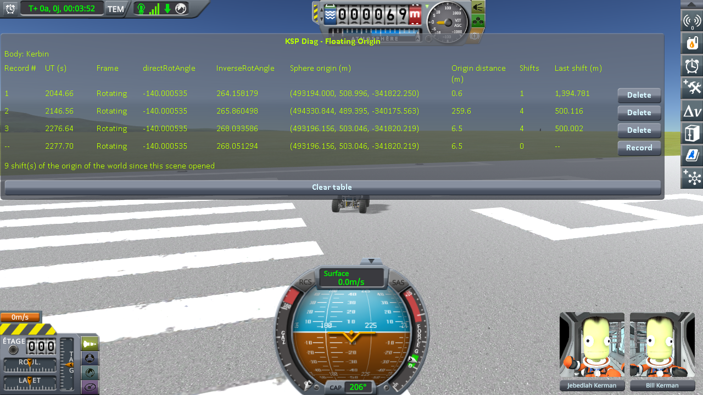

# The measurements: a rover driven 2 km and back

Part of [KSP Diag - Floating Origin](../README.md): [the protocol](the-protocol-driving.md), played on stock.

Played on KSP 1.12.5 with both expansions, [KSP Community
Fixes](https://github.com/KSPModdingLibs/KSPCommunityFixes) and the two mods it needs, Harmony and
ModuleManager, this mod and [KSP-MCPServer](https://github.com/lhervier/KSP-MCPServer), which plays the
protocol, and nothing else in `GameData`; by
[the script of the protocol](the-protocol-driving.md#played-by-a-script), `run-cases.py`, alone, in a session of its own.
The game's interface is in French. The bottom line of the table is the reading in progress, not a
record.

## The readings

`Diag3-Rover` on the runway: one record at the start, one at the far end of the runway, one back at
the start.

| record | directRotAngle | Sphere origin (m) | Origin distance (m) | Shifts | Last shift (m) |
|---|---|---|---|---|---|
| 1, at the start | -140.000535 | (493194.000, 508.996, -341822.250) | 0.6 | 1 | 1,394.781 |
| 2, at the far end | -140.000535 | (494330.844, 489.395, -340175.563) | 259.6 | 4 | 500.116 |
| 3, back at the start | -140.000535 | (493196.156, 503.046, -341820.219) | 6.5 | 4 | 500.002 |

The shift of line 1 is the one made by the rollout. Lines 1 and 3 are 6.6 m apart in **Sphere origin**.

**→ What it shows: [What the measurements show: a rover driven 2 km and back](what-the-measurements-show-driving.md)**

## The logs

In [`diag/runs`](../diag/README.md#the-runs):
[`case4-stock.log`](../diag/runs/case4-stock.log), the `KSP.log` of the session; what the script
printed in [`case4-stock-script.txt`](../diag/runs/case4-stock-script.txt), and every line it recorded
in [`case4-stock-lines.json`](../diag/runs/case4-stock-lines.json). The session of the other cases,
[`cases-stock.log`](../diag/runs/cases-stock.log), also played this case after
[a rover near a parked craft](the-measurements-parked-craft.md): the capsule of that case was still
within range, the origin never moved, and those lines are not used.
