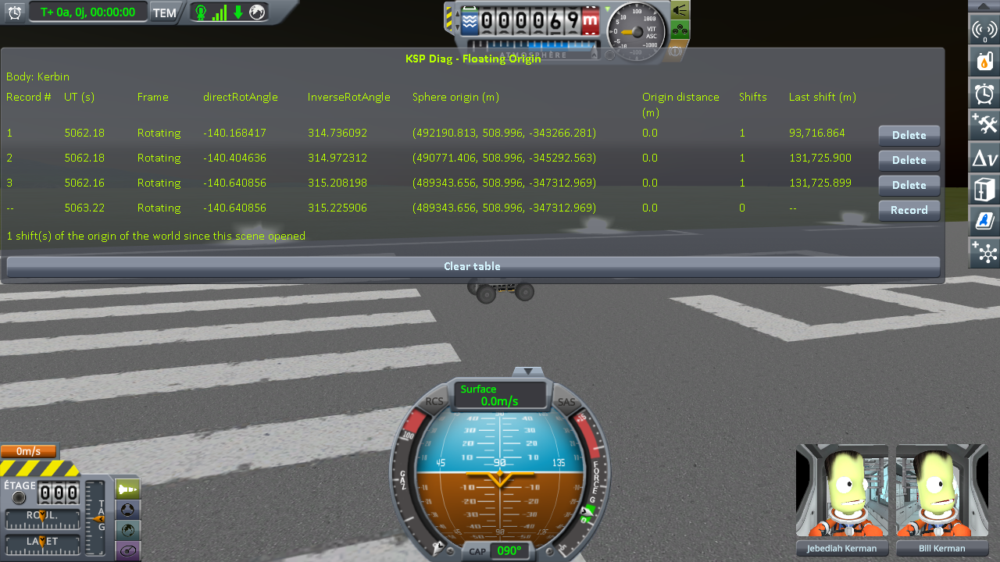

# The measurements: loading the same save three times

Part of [KSP Diag - Floating Origin](../README.md): [the protocol](the-protocol-loading.md), played on stock.

Played on KSP 1.12.5 with both expansions, [KSP Community
Fixes](https://github.com/KSPModdingLibs/KSPCommunityFixes) and the two mods it needs, Harmony and
ModuleManager, this mod and [KSP-MCPServer](https://github.com/lhervier/KSP-MCPServer), which plays the
protocol, and nothing else in `GameData`; by
[the script of the protocol](the-protocol-loading.md#played-by-a-script), `run-cases.py`, in one session with two other cases.
The game's interface is in French. The bottom line of the table is the reading in progress, not a
record.

## The readings

`Diag3-Rover` on the runway, quicksaved right after rollout, then quickloaded three times, about ten
seconds apart, with one record after each quickload.

| record | UT (s) | directRotAngle | Sphere origin (m) | Shifts | Last shift (m) |
|---|---|---|---|---|---|
| 1, after the first quickload | 5062.18 | -140.168417 | (492190.813, 508.996, -343266.281) | 1 | 93,716.864 |
| 2, after the second quickload | 5062.18 | -140.404636 | (490771.406, 508.996, -345292.563) | 1 | 131,725.900 |
| 3, after the third quickload | 5062.16 | -140.640856 | (489343.656, 508.996, -347312.969) | 1 | 131,725.899 |

Each quickload puts the clock back to the date of the quicksave: the UT of every line is that date,
plus the few seconds waited before the record. Each quickload shifted the world origin once.

**→ What it shows: [What the measurements show: loading the same save three times](what-the-measurements-show-loading.md)**

## The logs

In [`diag/runs`](../diag/README.md#the-runs):
[`cases-stock.log`](../diag/runs/cases-stock.log), the `KSP.log` of the session this case was played
in, with two other cases; what the script printed in
[`cases-stock-script.txt`](../diag/runs/cases-stock-script.txt), and every line it recorded in
[`cases-stock-lines.json`](../diag/runs/cases-stock-lines.json).
