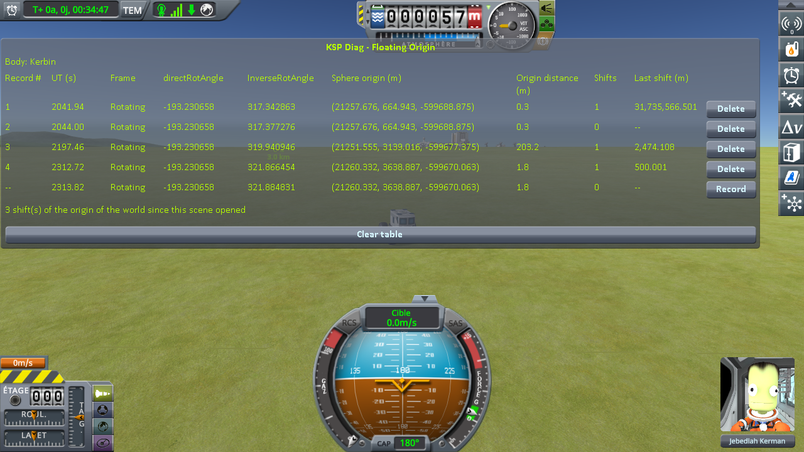

# The measurements: a rover near a parked craft, then on its own

Part of [KSP Diag - Floating Origin](../README.md): [the protocol](the-protocol-parked-craft.md), played on stock.

Played on KSP 1.12.5 with both expansions, [KSP Community
Fixes](https://github.com/KSPModdingLibs/KSPCommunityFixes) and the two mods it needs, Harmony and
ModuleManager, this mod and [KSP-MCPServer](https://github.com/lhervier/KSP-MCPServer), which plays the
protocol, and nothing else in `GameData`; by
[the script of the protocol](the-protocol-parked-craft.md#played-by-a-script), `run-cases.py`, in one session with two other cases.
The game's interface is in French. The bottom line of the table is the reading in progress, not a
record.

## The readings

`approach-kerbin`, one drive: one record at the start, one 100 m from the capsule, one once the capsule
was unloaded, one after the next shift.

| record | UT (s) | Sphere origin (m) | Origin distance (m) | Shifts | Last shift (m) |
|---|---|---|---|---|---|
| 1, at the start | 2041.94 | (21257.676, 664.943, -599688.875) | 0.3 | 1 | 31,735,566.501 |
| 2, 100 m from the capsule | 2044.00 | (21257.676, 664.943, -599688.875) | 0.3 | 0 | -- |
| 3, capsule unloaded | 2197.46 | (21251.555, 3139.016, -599677.375) | 203.2 | 1 | 2,474.108 |
| 4, after the next shift | 2312.72 | (21260.332, 3638.887, -599670.063) | 1.8 | 1 | 500.001 |

The shift of line 1 is the one made by loading the save. The save opens with the rover 26 m from the
capsule, so line 2 was recorded where line 1 was, two seconds later. **Origin distance** is read once
the rover has stopped, a little after the shift of lines 3 and 4.

**→ What it shows: [What the measurements show: a rover near a parked craft, then on its own](what-the-measurements-show-parked-craft.md)**

## The logs

In [`diag/runs`](../diag/README.md#the-runs):
[`cases-stock.log`](../diag/runs/cases-stock.log), the `KSP.log` of the session this case was played
in, with two other cases; what the script printed in
[`cases-stock-script.txt`](../diag/runs/cases-stock-script.txt), and every line it recorded in
[`cases-stock-lines.json`](../diag/runs/cases-stock-lines.json).
