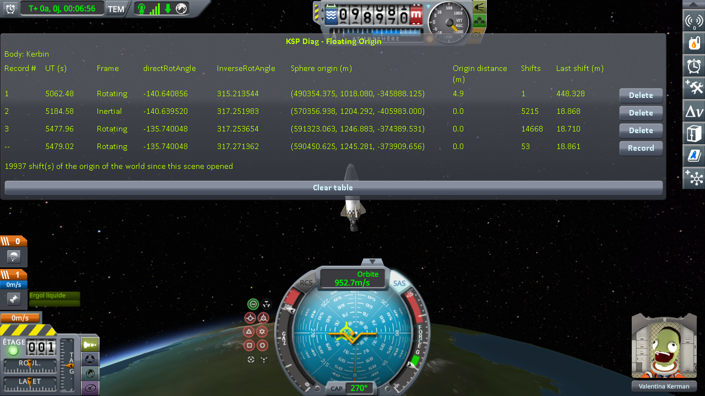

# The measurements: leaving the rotating frame and coming back, in one flight

Part of [KSP Diag - Floating Origin](../README.md): [the protocol](the-protocol-rotating-frame.md), played on stock.

Played on KSP 1.12.5 with both expansions, [KSP Community
Fixes](https://github.com/KSPModdingLibs/KSPCommunityFixes) and the two mods it needs, Harmony and
ModuleManager, this mod and [KSP-MCPServer](https://github.com/lhervier/KSP-MCPServer), which plays the
protocol, and nothing else in `GameData`; by
[the script of the protocol](the-protocol-rotating-frame.md#played-by-a-script), `run-cases.py`, in one session with two other cases.
The game's interface is in French. The bottom line of the table is the reading in progress, not a
record.

## The readings

`Diag3-Rocket` from the launch pad, SAS on, straight up at full throttle: one record on the pad, one
once **Frame** read `Inertial`, one once it read `Rotating` again, on the way down.

| record | UT (s) | Frame | directRotAngle | InverseRotAngle | Shifts | Last shift (m) |
|---|---|---|---|---|---|---|
| 1, on the pad | 5062.48 | Rotating | -140.640856 | 315.213544 | 1 | 448.328 |
| 2, above the threshold | 5184.58 | Inertial | -140.639520 | 317.251983 | 5215 | 18.868 |
| 3, back below it | 5477.96 | Rotating | -135.740048 | 317.253654 | 14668 | 18.710 |

**Frame** changed at 100 km: the script, which reads it every fifth of a second, saw it switch at an
altitude of 100,093 m on the way up and 99,880 m on the way down. Between lines 1 and 3,
`directRotAngle` moved by 4.900808°: Kerbin's rotation over 293.4 s. In flight, the world origin was
shifted 19,883 times, by about 19 m each time.

**→ What it shows: [What the measurements show: leaving the rotating frame and coming back, in one flight](what-the-measurements-show-rotating-frame.md)**

## The logs

In [`diag/runs`](../diag/README.md#the-runs):
[`cases-stock.log`](../diag/runs/cases-stock.log), the `KSP.log` of the session this case was played
in, with two other cases; what the script printed in
[`cases-stock-script.txt`](../diag/runs/cases-stock-script.txt), and every line it recorded in
[`cases-stock-lines.json`](../diag/runs/cases-stock-lines.json).
